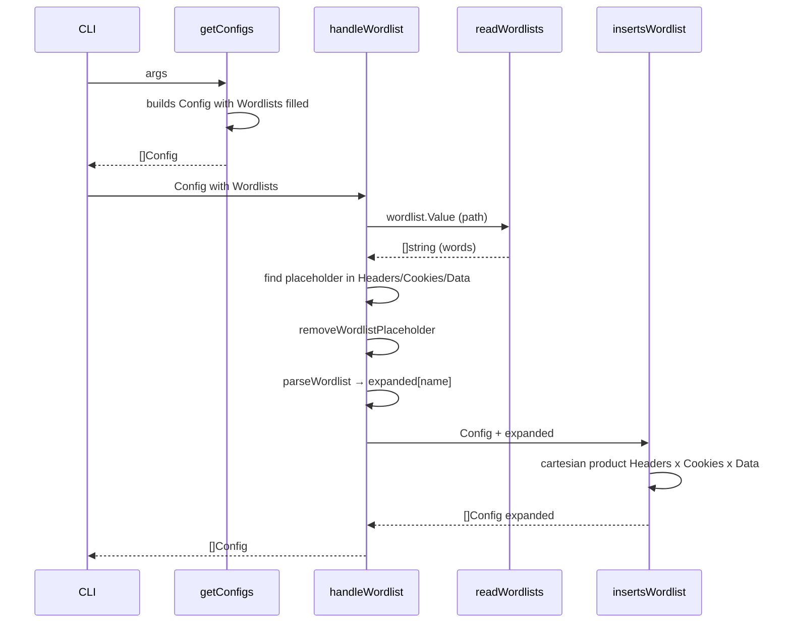

## Wordlist Flow
 

```mermaid
sequenceDiagram
    participant CLI
    participant getConfigs
    participant handleWordlist
    participant readWordlists
    participant insertsWordlist
 
    CLI->>getConfigs: args
    getConfigs->>getConfigs: builds Config with Wordlists filled
    getConfigs-->>CLI: []Config
 
    CLI->>handleWordlist: Config with Wordlists
    handleWordlist->>readWordlists: wordlist.Value (path)
    readWordlists-->>handleWordlist: []string (words)
 
    handleWordlist->>handleWordlist: find placeholder in Headers/Cookies/Data
    handleWordlist->>handleWordlist: removeWordlistPlaceholder
    handleWordlist->>handleWordlist: parseWordlist → expanded[name]
 
    handleWordlist->>insertsWordlist: Config + expanded
    insertsWordlist->>insertsWordlist: cartesian product Headers x Cookies x Data
    insertsWordlist-->>handleWordlist: []Config expanded
    handleWordlist-->>CLI: []Config
```
