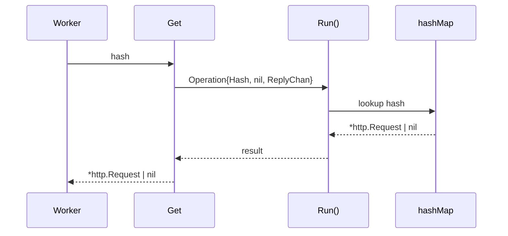
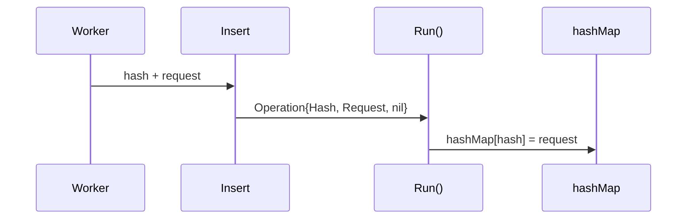

## Cache Lookup

```mermaid
sequenceDiagram
    participant Worker
    participant Get
    participant Cache as Run()
    participant Map as hashMap

    Worker->>Get: hash
    Get->>Cache: Operation{Hash, nil, ReplyChan}

    Cache->>Map: lookup hash
    Map-->>Cache: *http.Request | nil

    Cache-->>Get: result
    Get-->>Worker: *http.Request | nil
```

## Cache Insert

```mermaid
sequenceDiagram
    participant Worker
    participant Insert
    participant Cache as Run()
    participant Map as hashMap

    Worker->>Insert: hash + request
    Insert->>Cache: Operation{Hash, Request, nil}

    Cache->>Map: hashMap[hash] = request
```
